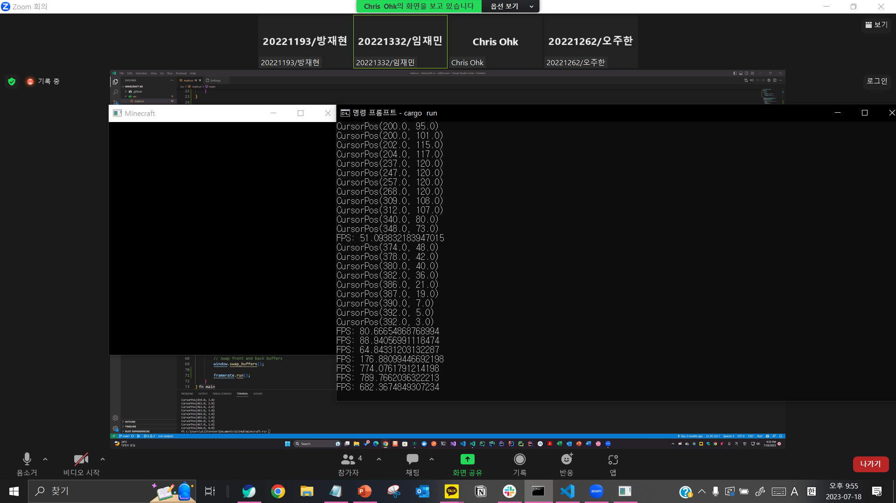
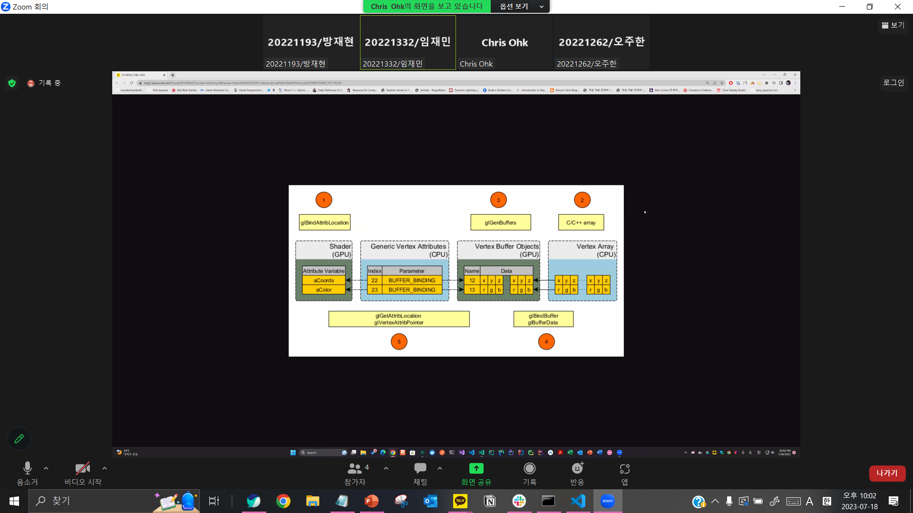
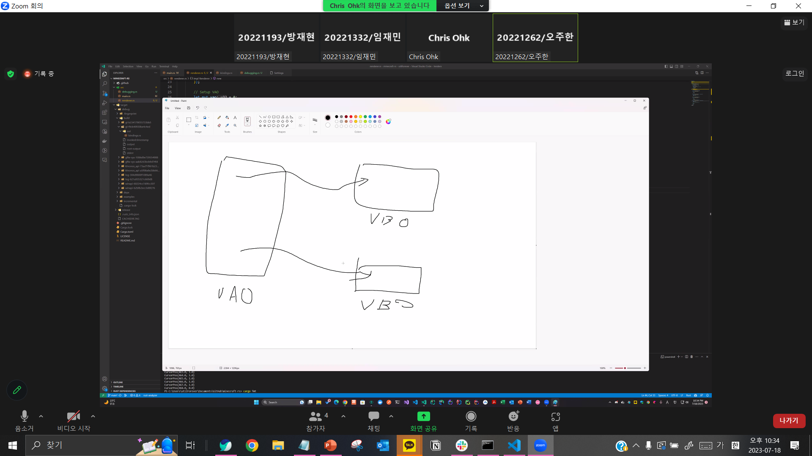
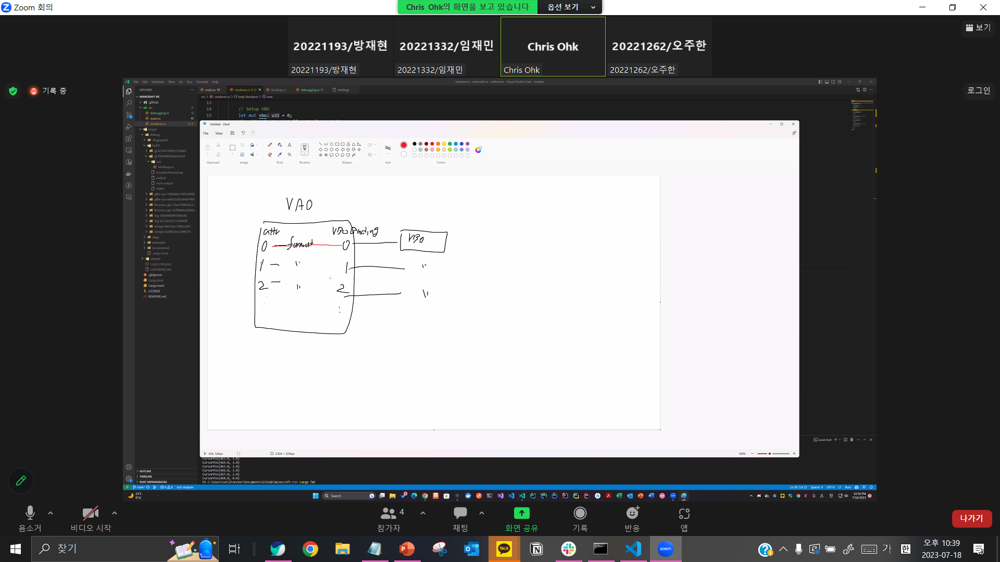
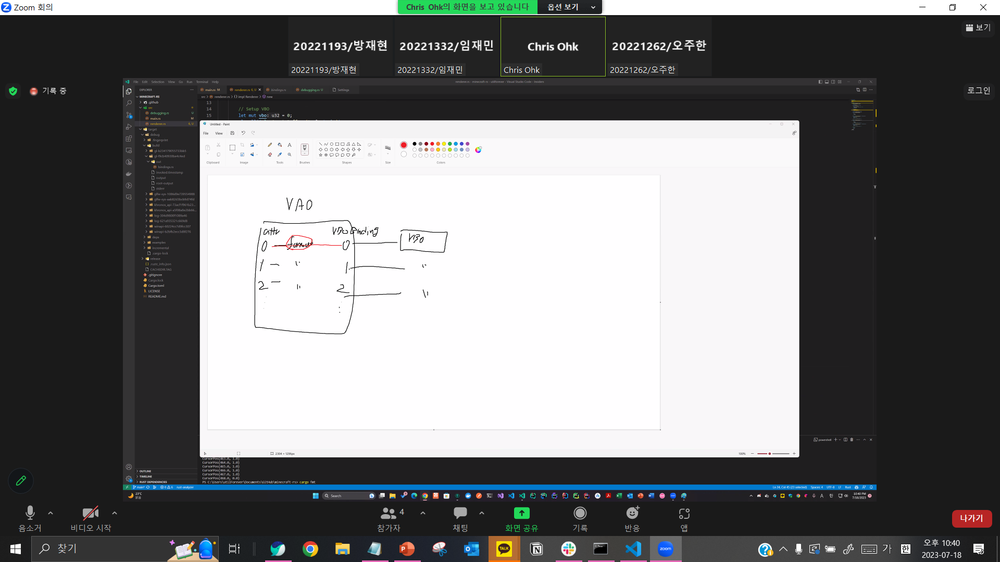
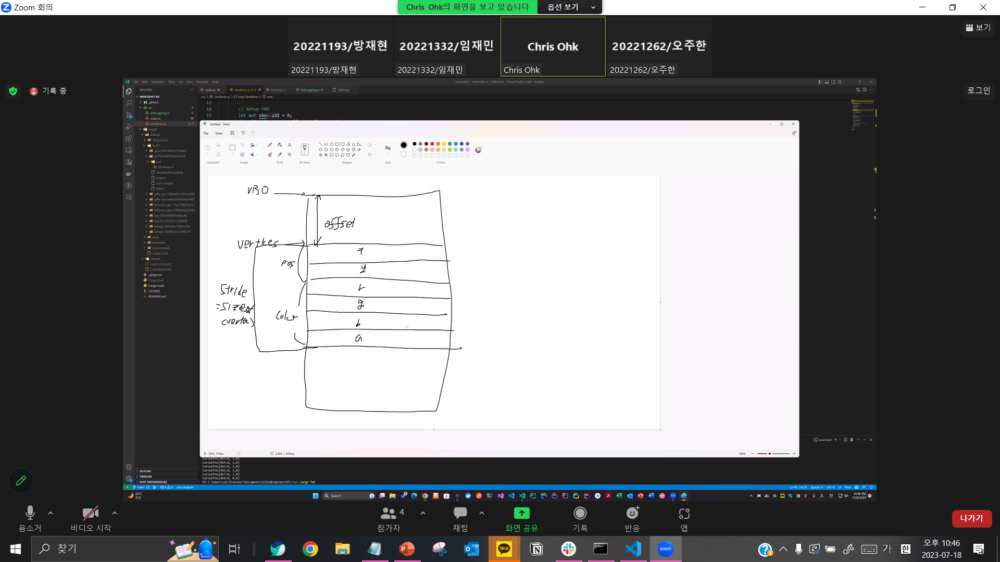

# r-minecraft
My own Rust Minecraft with instruction by @utilforever

- 230716

- 23018
- 
- 

 <!-- VAO가 VBO에 담긴 데이터를 어떻게 해석할지를 지정. -->
  <!-- stride의 개념: sizeof(vertex), vertex가 position과 color로 되어있는 것. -->

